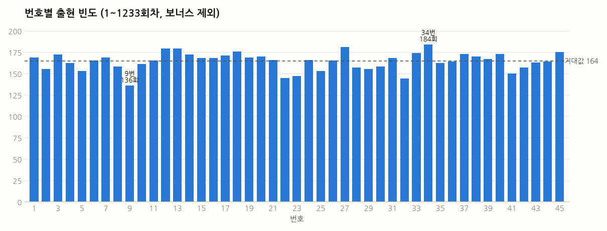
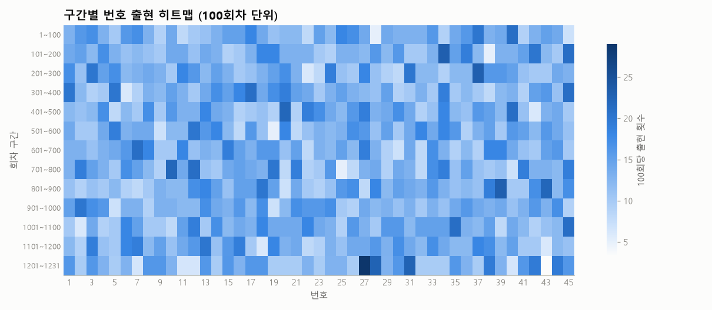
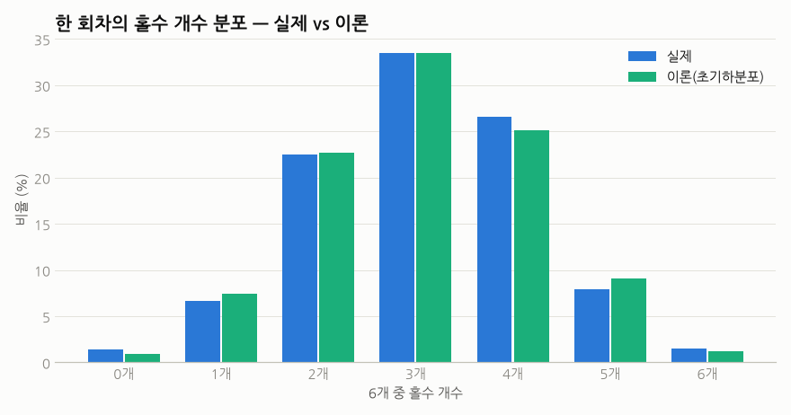
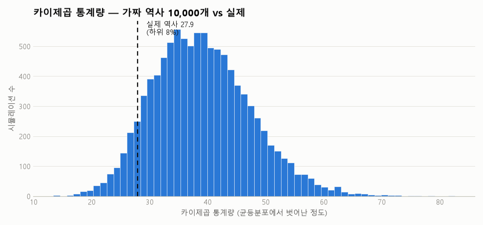
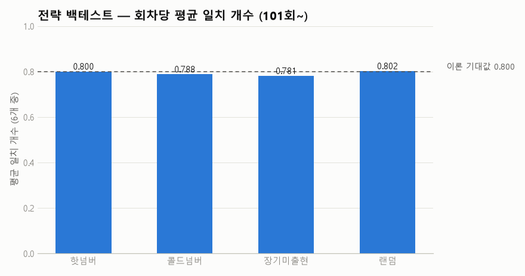

# 로또 데이터 놀이터 🎱

동행복권 로또 6/45 당첨번호를 전부 긁어와서 이것저것 분석해보는 재미 프로젝트.

## 구성

| 파일 | 설명 |
|---|---|
| `collect_data.py` | 당첨번호 수집기 (공식 API 우선, 막히면 미러 폴백, 증분 수집) |
| `analyze.py` | 통계 분석 + 차트 생성 |
| `generate.py` | 번호 생성기 — 빈도형/역발상형/균형형/구간회피형/완전랜덤 5가지 모드 |
| `prove_random.py` | "로또는 랜덤이다" 검증 — 카이제곱/백테스트/몬테카를로 |
| `.github/workflows/weekly.yml` | 매주 토요일 추첨 후 자동 수집+차트 갱신 (GitHub Actions) |
| `data/lotto.csv` | 1회~최신회차 당첨번호 데이터 |
| `charts/` | 분석 차트 |

## 사용법

```bash
python -m venv .venv
.venv\Scripts\activate
pip install -r requirements.txt

python collect_data.py   # 데이터 수집 (재실행하면 새 회차만 추가)
python analyze.py        # 분석 + 차트 생성
python generate.py       # 이번 주 추천 번호 (모드별 5게임)
python generate.py balanced -n 10   # 균형형만 10게임
python generate.py avoid -w 5       # 구간회피형: 최근 5주 최다 출현 구간(1~10, 11~20...) 제외
python prove_random.py   # 랜덤성 검증 (몬테카를로 1만 회)
```

## 주요 결과 (1~1230회차 기준)

- **최다 출현**: 34번(184회), 27번(181회) / **최소 출현**: 9번(136회) — 기대값은 164회
- **홀짝**: 회차당 평균 홀수 3.07개 — 이론값(초기하분포) 3.07개와 정확히 일치
- **합계**: 평균 138.3 — 이론 기대값 138과 거의 일치
- **연속번호**: 절반이 넘는 회차(51.8%)에 연속 쌍이 포함됨 (직관과 달리 흔한 일)

요약: 전부 "완전 랜덤"이 예측하는 그대로 (아래 최종 판결 참고).





## 최종 판결: 로또는 랜덤이다 ⚖️

`prove_random.py` 실행 결과 (1~1230회차):

1. **카이제곱 검정** — 번호별 빈도의 치우침 정도(통계량 27.9)는 몬테카를로 p-값 0.92.
   완전 랜덤이 만드는 치우침보다 오히려 *더 고른* 편. 균등분포와 구분 불가.
2. **전략 백테스트** (101회~1230회, 1,130회 테스트) — 회차당 평균 일치 개수:
   핫넘버 0.800 / 콜드넘버 0.788 / 장기미출현 0.781 / 랜덤 0.802.
   이론 기대값 0.800 근처에서 도토리 키재기. 어떤 전략도 랜덤을 못 이김.
3. **몬테카를로** — 가짜 로또 역사 10,000개를 만들어 실제 역사를 섞어놓으면
   카이제곱 하위 8%, 연속쌍 비율 하위 21% 지점. 지극히 평범한 랜덤 역사 중 하나.

즉, `generate.py` 의 전략들은 전부 의미 없음이 스스로 증명됨. 그래도 재밌으니 됐다 ㅋㅋ




## 로드맵

- [x] 1단계: 데이터 수집 + 통계 분석
- [x] 2단계: 통계 기반 번호 생성기 (빈도형/역발상형/균형형/완전랜덤)
- [x] 3단계: "로또는 랜덤이다" 통계적 증명 (카이제곱, 백테스트, 몬테카를로)
- [x] 자동화: 매주 토요일 추첨 후 GitHub Actions가 수집+차트 갱신 자동 커밋
